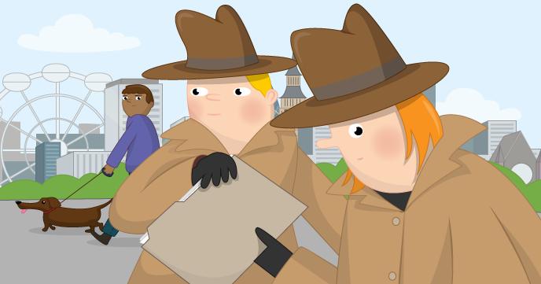

# Secret Agent Chat

In this resource you will learn how to create and use an encryption technique known as the one-time pad. This method of encryption will allow you to send secret messages to your friends and, as long as you're careful, the messages will be *unbreakable*.

## Licence

Unless otherwise specified, everything in this repository is covered by the following licence:

***Secret Agent Chat*** by the [Raspberry Pi Foundation](http://www.raspberrypi.org) is licenced under a [Creative Commons Attribution 4.0 International License](http://creativecommons.org/licenses/by-sa/4.0/).

Based on a work at https://github.com/raspberrypilearning/secret-agent-chat
