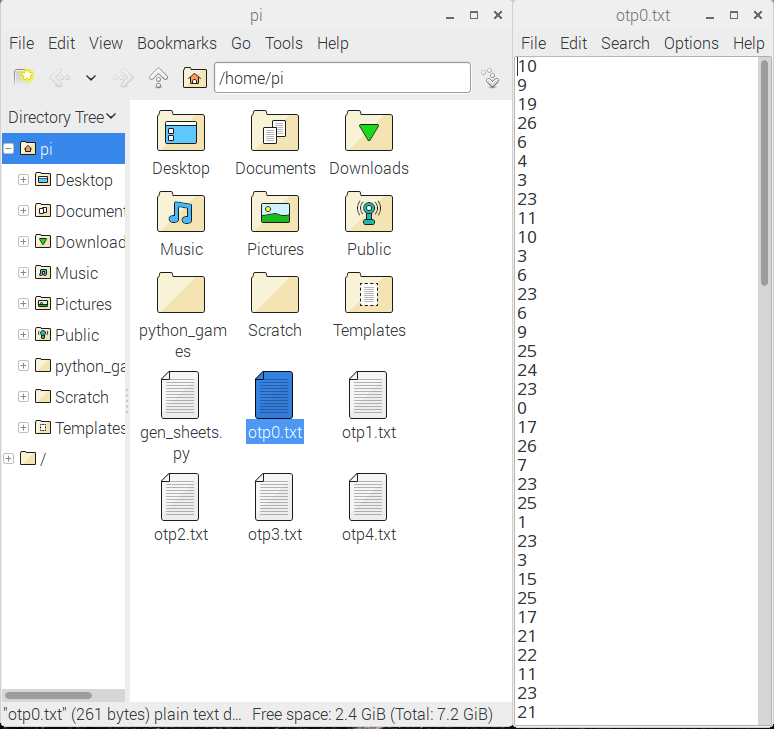

## Generating a one-time pad

Open a new Python file in Idle or Mu.

- The first thing you need is some random numbers, so import the `randint` method from the `random` module:

    ```python
    from random import randint
    ```

- It is worth noting, that if we were real secret agents, then using `random` might be a little insecure. [os.urandom](https://docs.python.org/3/library/os.html#os.urandom) is a much more secure way of generating random numbers.

- Later on you're going to need the alphabet as well, so it's best to declare this constant now:

    ```python
    ALPHABET = 'abcdefghijklmnopqrstuvwxyz'
    ```

- Next, you can create a function to generate an OTP. It will need to have parameters for the number of sheets in the pad and the number of characters that each sheet can encrypt:

    ```python
    def generate_otp(sheets, length):
    ```

- Now a new file needs to be created for every sheet. Each file will be saved as `.txt` with the following naming convention: `otp0.txt, otp1.txt, otp2.txt`. You can use a `for` loop for this:

    ```python
    def generate_otp(sheets, length):
        for sheet in range(sheets):
            with open("otp" + str(sheet) + ".txt","w") as f:
    ```

- Finally for this function, you can add in two lines of code that will write out the random numbers to the file. Here, you're adding a `\n` character to the end of each number, so it's written to a new line.

    ```python
    def generate_otp(sheets, length):
        for sheet in range(sheets):
            with open("otp" + str(sheet) + ".txt","w") as f:
                for i in range(length):
                    f.write(str(randint(0,26))+"\n")
    ```


- Test your code by saving (`ctrl+s`) and running (`F5`). Then type `generate_otp(5, 100)` into the **shell**

- If you open your file browser, you should see 5 new files have been created. Open one of them and you'll see a column of random numbers. These files are collectively called your one-time pad.



