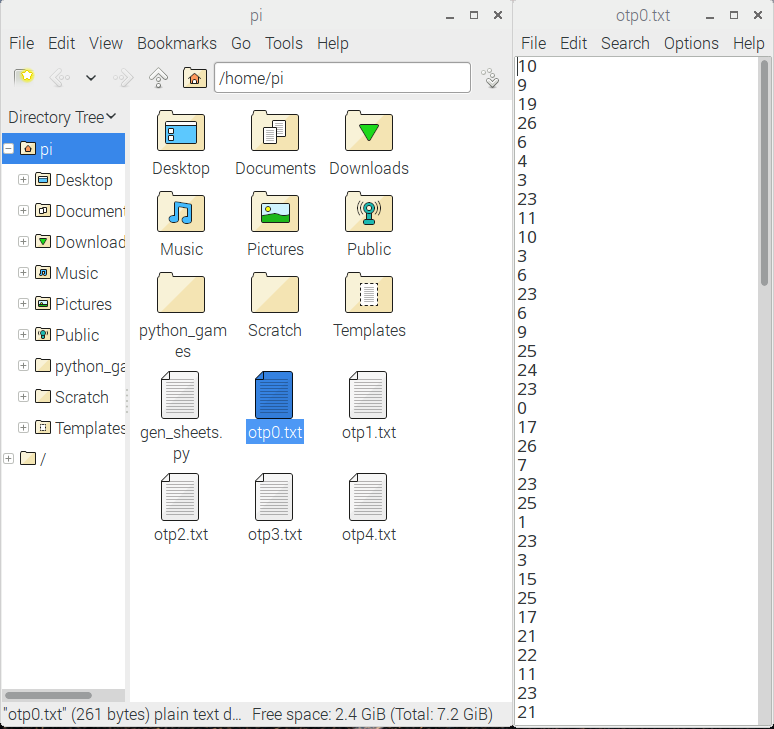

## वन-टाइम पैड बनाना

Idle या Mu में एक नई Python फ़ाइल खोलें।

- पहली चीज़ जो आपको चाहिए वह हैं, कुछ क्रमरहित(अनोखी) संख्याएँ। इसलिए `random` मॉड्यूल (module) से `randint` विधि (method) आयात (import) करें:

    ```python
    from random import randint
    ```

- यह ध्यान देने योग्य है कि अगर हम असली गुप्त जासूस होते है, तो `random` का उपयोग थोड़ा असुरक्षित हो सकता है। [os.urandom](https://docs.python.org/3/library/os.html#os.urandom) क्रमरहित संख्या उत्पन्न करने का ज्यादा सुरक्षित तरीका है।

- बाद में आपको वर्णमाला की भी आवश्यकता होती है, इसलिए इस कॉन्स्टन्ट (constant) को अब घोषित (declare) करना सबसे अच्छा है:

    ```python
    ALPHABET = 'abcdefghijklmnopqrstuvwxyz'
    ```

- आगे, आप OTP उत्पन्न करने के लिए एक फ़ंक्शन (function) बना सकते हैं। पैड (pad) में शीट (sheets) की संख्या और प्रत्येक शीट को एन्क्रिप्ट करने वाले वर्णों की संख्या के लिए पैरामीटर (parameters) होना आवश्यक है:

    ```python
    def generate_otp(sheets, length):
    ```

- अब हर शीट के लिए एक नई फाइल बनानी होगी। प्रत्येक फ़ाइल को `.txt` के रूप में सहेजा जाएगा, निम्नलिखित नामकरण रूढ़ि के साथ: `otp0.txt, otp1.txt, otp2.txt`। ऐसा करने के लिए आप `for` लूप का उपयोग कर सकते हैं।

    ```python
    def generate_otp(sheets, length):
        for sheet in range(sheets):
            with open("otp" + str(sheet) + ".txt","w") as f:
    ```

- अंत में इस फ़ंक्शन के लिए, आप कोड की दो पंक्तियां जोड़ सकते हैं, जो फ़ाइल में यादृच्छिक संख्याएं लिखेंगी। यहां, आप प्रत्येक संख्या के अंत में `\n` वर्ण जोड़ रहे हैं, इसलिए यह एक नई पंक्ति में लिखा गया है।

    ```python
    def generate_otp(sheets, length):
        for sheet in range(sheets):
            with open("otp" + str(sheet) + ".txt","w") as f:
                for i in range(length):
                    f.write(str(randint(0,26))+"\n")
    ```


- अपना कोड सहेजकर (`ctrl+s`) और चला कर (`F5`) परीक्षण करें। फिर **shell** में `generate_otp(5, 100)` लिखे।

- यदि आप अपना फ़ाइल ब्राउज़र खोलते हैं, तो आपको 5 नई फाइलें बनी हुई दिखनी चाहिए। उनमें से एक खोलें और आपको यादृच्छिक संख्याओं की एक सूची दिखाई देगी। इन फाइलों को सामूहिक रूप से आपका वन-टाइम पैड कहा जाता है।



