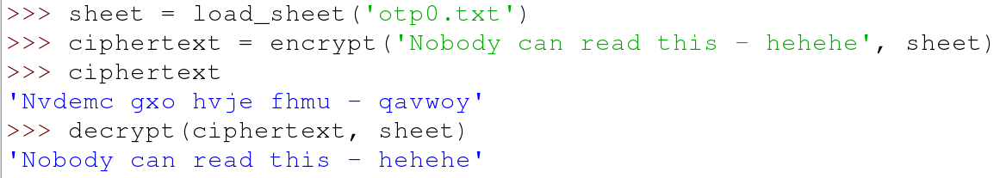

## संदेशों को डिक्रिप्ट करना

अपने दोस्तों के साथ संवाद करते समय, आपको संदेश को डिक्रिप्ट करने के तरीके की भी आवश्यकता होगी। अगला फ़ंक्शन पिछले के समान है, लेकिन वन-टाइम पैड की शीट से मूल्य को जोड़ने के बजाय, आपको बस मूल्य को घटाना होगा:

```python
def decrypt(ciphertext, sheet):
    plaintext = ''
    for position, character in enumerate(ciphertext):
        if character not in ALPHABET:
            plaintext += character
        else:
            decrypted = (ALPHABET.index(character) - int(sheet[position])) % 26
            plaintext += ALPHABET[decrypted]
    return plaintext
```

- चलो डिक्रिप्शन का परीक्षण करें। अपना कोड सहेजें और चलाएं, फिर **shell** में निम्नलिखित टाइप करें

    ```python
    sheet = load_sheet('otp0.txt')
    ciphertext = encrypt('Nobody can read this - hehehe', sheet)
    ciphertext
    ```

- आपको एन्क्रिप्टेड अक्षर दिखने चाहिए। डिक्रिप्ट करने के लिए, बस निम्नलिखित पंक्ति टाइप करें:

```python
decrypt(ciphertext, sheet)
```



