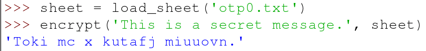

## Encrypting a message

Now comes the fun part: you're going to encrypt a message using a sheet from the one-time pad. This function will have two parameters. The first will be for a `string` that contains the plaintext message; the second will be for the one-time pad sheet that will be used.

- To start with, you can define the function:

    ```python
    def encrypt(plaintext, sheet):
    ```

- Once you start encrypting the plaintext, you'll need to store the ciphertext. You can use an empty string to do this:

    ```python
    def encrypt(plaintext, sheet):
        ciphertext = ''
    ```

- Now comes the clever part. This function is going to act on every character in the plaintext, a process called 'iteration'. While it's doing this, it needs to keep track of which character it's working on and what position that character has in the plaintext. To do this, you can use the built-in function `enumerate()`:

    ```python
    def encrypt(plaintext, sheet):
        ciphertext = ''
        for position, character in enumerate(plaintext):
    ```

- The next thing to do is check if the character from the plaintext is in the alphabet or not. In this program you're not going to bother encrypting spaces or punctuation, so if the character is not a letter, it can just be added to the ciphertext string. This is where we use that `ALPHABET` constant you wrote earlier:

    ```python
    def encrypt(plaintext, sheet):
        ciphertext = ''
        for position, character in enumerate(plaintext):
            if character not in ALPHABET:
                ciphertext += character
    ```

- The next part is quite tricky to understand.

    - Firstly, you need to find the position of the plaintext character in the alphabet - `ALPHABET.index(character)`.
    - Then you need to add this number to the value from the equivalent position on the sheet from the OTP - `int(sheet[position])`.
    - This new number needs to be converted back into a letter. If the new number was `0` it would become `a`, if it was `5` it would become `f` and so on. What if the number is greater than 25, though? If the number is `26` it needs to be changed to `0`, and if it's `30` it should be changed to `4`. To do this we can use the **modulo** operator (`%`), which finds the remainder after a division.
    - Lastly, the number is converted to a letter.

- Putting that all together into your function, it would look like this:

    ```python
    def encrypt(plaintext, sheet):
        ciphertext = ''
        for position, character in enumerate(plaintext):
            if character not in ALPHABET:
                ciphertext += character
            else:
                encrypted = (ALPHABET.index(character) + int(sheet[position])) % 26
                ciphertext += ALPHABET[encrypted]
    ```

- You can finish off by returning the ciphertext:

    ```python
    def encrypt(plaintext, sheet):
        ciphertext = ''
        for position, character in enumerate(plaintext):
            if character not in ALPHABET:
                ciphertext += character
            else:
                encrypted = (ALPHABET.index(character) + int(sheet[position])) % 26
                ciphertext += ALPHABET[encrypted]
        return ciphertext
    ```


- To test your function you can save and run your code and then type the following into the **shell**.

```python
sheet = load_sheet('otp0.txt')
encrypt('This is a secret message.', sheet)
```



