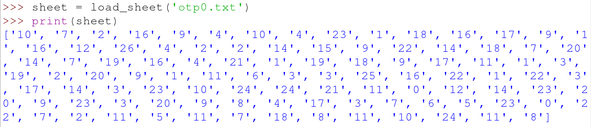

## Loading a sheet from the OTP

Now that the OTP has been generated, you need a way to load a sheet and store all its numbers in a list.

- First, you can create a function to open a file:

   ```python
   def load_sheet(filename):
       with open(filename, "r") as f:
   ```

- Then you can load the contents of the file into a list. The `splitlines()` part breaks each line up into a single item in the list and also removes the `\n` character (newline):

    ```python
    def load_sheet(filename):
        with open(filename, "r") as f:
            contents = f.read().splitlines()
        return contents
    ```

- Test this function by saving and running your code again. Now in the **shell** you can type the following:

```python
sheet = load_sheet('otp0.txt')
print(sheet)
```




