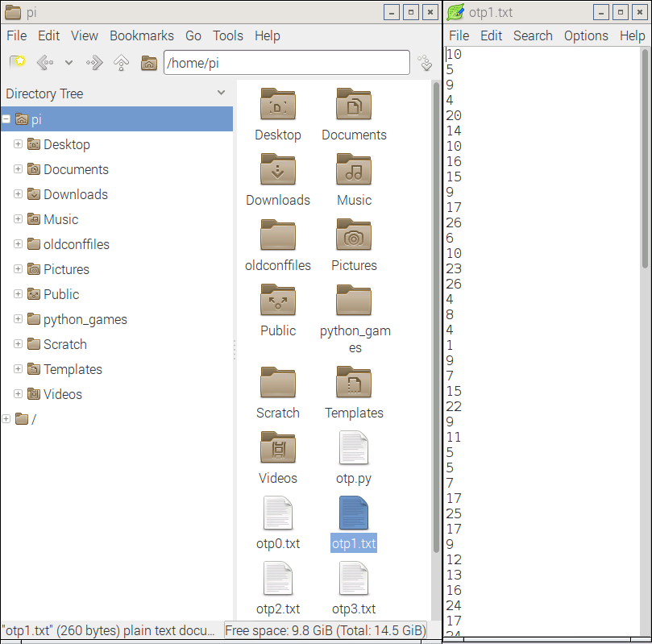

# Secret agent chat

In this resource you will learn how to send secret messages using a technique called the one-time pad.


When you're a secret agent, sending messages to your friends can be a tricky business. If the message is seen by your enemies they'll know what you're up to, and you could be in trouble.

Cryptography is a way of disguising the contents of your message, to make it harder for your enemies to read. One of the first forms of cryptography was used by the Roman emperor Julius Caesar, and is now called the *Caesar Cipher*.

Imagine Alice wants to send a secret message to Bob, without Eve knowing what the message says. Alice first picks a **key**, which will be a number such as `3`. Alice then tells Bob the key.

Whenever Alice wants to write a message, all she needs to do is shift each of the letters in her message forward in the alphabet by 3 places:

```
abcdefghijklmnopqrstuvwxyz
defghijklmnopqrstuvwxyzabc
```

So the **plaintext**...

```
Meet me at the park at three
```

becomes the **ciphertext**...

```
Phhw ph dw wkh sdun dw wkuhh
```

The problem with this is that Eve can easily decrypt the message. She just needs to try using every number between 1 and 26 as the key, and see which one makes sense. She could also look for words with 2 or 3 letters in them that occur a lot, like 'to', 'at', 'the' or 'and', then use these to find out what the key is.

During World War II the German military thought they had developed a perfect method of encrypting messages, using something called an [Enigma machine](https://simple.wikipedia.org/wiki/Enigma_%28machine%29).


They were wrong, though, as there's no such thing as perfect cryptography. Thanks to some clever Polish mathematicians and a British mathematician called Alan Turing, the Enigma messages were decrypted, and this helped the Allies win the war.

A one-time pad (OTP) is a different method of encryption. When using an OTP, a string of random numbers are generated and shared between Alice and Bob. Each letter of the message is then shifted by the corresponding number in the OTP, so each letter has its own individual key! As long as Eve doesn't have the OTP, the message is **impossible** to decrypt.


## Generating a one-time pad

Open a new Python file in your preferred editor.

1. The first thing you need is some random numbers, so import the `randint` method from the `random` module:

	```python
	from random import randint
	```

1. Later on you're going to need the alphabet as well, so it's best to declare this constant now:

	```python
	ALPHABET = 'abcdefghijklmnopqrstuvwxyz'
	```

1. Next, you can create a function to generate an OTP. It will need to have parameters for the number of sheets in the pad and the number of characters that each sheet can encrypt:

	```python
	def generateOTP(sheets, length):
	```

1. Now a new file needs to be created for every sheet. Each file will be saved as `.txt` with the following naming convention: `otp0.txt, otp1.txt, otp2.txt`. You can use a `for` loop for this:

	```python
	def generate_otp(sheets, length):
		for sheet in range(sheets):
			with open("otp" + str(sheet) + ".txt","w") as f:
    ```

1. Finally for this function, you can add in two lines of code that will write out the random numbers to the file. Here, you're adding a `\n` character to the end of each number, so it's written to a new line.

	```python
	def generate_otp(sheets, length):
		for sheet in range(sheets):
			with open("otp" + str(sheet) + ".txt","w") as f:
				for i in range(length):
					f.write(str(randint(0,26))+"\n")
	```

1. Test your code by saving (`Ctrl+s`) and running (`F5`). Now type `generate_OTP(5, 100)` into the **shell**.

1. If you open your file browser, you should see 5 new files have been created. Open one of them and you'll see a column of random numbers. These files are collectively called your one-time pad.



## Loading a sheet from the OTP

Now that the OTP has been generated, you need a way to load a sheet and store all its numbers in a list.

1. First, you can create a function to open a file:

   ```python
   def load_sheet(filename):
	   with open(filename, "r") as f:
   ```

1. Then you can load the contents of the file into a list. The `splitlines()` part breaks each line up into a single item in the list and also removes the `\n` character (newline):

	```python
	def load_sheet(filename):
		with open(filename, "r") as f:
			contents = f.read().splitlines()
		return contents
	```

1. Test this function by saving and running your code again. Now in the **shell** you can type the following:

```python
sheet = load_sheet('otp0.txt')
print(sheet)
```


## Writing a secret message

The next function is a really simple one: it asks the user to type in the message that will be encrypted. The only small addition is to convert all the letters to *lowercase*, as this will make it easier to encrypt without losing any meaning:

```python
def get_plain_text():
    plain_text = input('Please type your message ')
    return plain_text.lower()
```

## Loading and saving the messages

Next, you're going to need a method of opening messages written to you, and saving the messages that have been encrypted. Again, you're going to need a couple of fairly basic functions - one to open and read a file, the other to open and write a file:

```python
def load_file(filename):
    with open(filename, "r") as f:
        contents = f.read()
    return contents

def save_file(filename, data):
    with open(filename, 'w') as f:
        f.write(data)
```

## Encrypting a message

Now comes the fun part: you're going to encrypt a message using a sheet from the one-time pad. This function will have two parameters. The first will be for a `string` that contains the plaintext message; the second will be for the one-time pad sheet that will be used.

1. To start with, you can define the function:

	```python
	def encrypt(plaintext, sheet):
	```

1. Once you start encrypting the plaintext, you'll need to store the ciphertext. You can use an empty string to do this:

	```python
	def encrypt(plaintext, sheet):
		ciphertext = ''
	```

1. Now comes the clever part. This function is going to act on every character in the plaintext, a process called 'iteration'. While it's doing this, it needs to keep track of which character it's working on and what position that character has in the plaintext. To do this, you can use the built-in function `enumerate()`:

	```python
	def encrypt(plaintext, sheet):
		ciphertext = ''
		for position, character in enumerate(plaintext):
	```

1. The next thing to do is check if the character from the plaintext is in the alphabet or not. In this program you're not going to bother encrypting spaces or punctuation, so if the character is not a letter, it can just be added to the ciphertext string. This is where we use that `ALPHABET` constant you wrote earlier:

	```python
	def encrypt(plaintext, sheet):
		ciphertext = ''
		for position, character in enumerate(plaintext):
			if character not in ALPHABET:
				ciphertext += character
	```

1. The next part is quite tricky to understand.

    - Firstly, you need to find the position of the plaintext character in the alphabet - `ALPHABET.index(character)`.
    - Then you need to add this number to the value from the equivalent position on the sheet from the OTP - `int(sheet[position])`.
    - This new number needs converted back into a letter. If the new number was `0` it would become `a`, if it was `5` it would become `f` and so on. What if the number is greater than 25, though? If the number is `26` it needs to be changed to `0`, and if it's `30` it should be changed to `4`. To do this we can use the **modulo** operator (`%`), which finds the remainder after a division.
    - Lastly, the number is converted to a letter.

1. Putting that all together into your function, it would look like this:

	```python
	def encrypt(plaintext, sheet):
		ciphertext = ''
		for position, character in enumerate(plaintext):
			if character not in ALPHABET:
				ciphertext += character
			else:
				encrypted = (ALPHABET.index(character) + int(sheet[position])) % 26
				ciphertext += ALPHABET[encrypted]
	```

1. You can finish off by returning the ciphertext:

	```python
	def encrypt(plaintext, sheet):
		ciphertext = ''
		for position, character in enumerate(plaintext):
			if character not in ALPHABET:
				ciphertext += character
			else:
				encrypted = (ALPHABET.index(character) + int(sheet[position])) % 26
				ciphertext += ALPHABET[encrypted]
		return ciphertext
	```

## Testing the encryption

To test your function, save and run your code and then type the following into the **shell**:

```python
sheet = load_sheet('otp0.txt')
encrypt('This is a secret message.', sheet)
```


## Decrypting messages

When communicating with your friends, you'll need a way to decrypt the message as well. The next function is very similar to the previous one, but instead of adding the value from the one-time pad's sheet, you just need to subtract the value:

```python
def decrypt(ciphertext, sheet):
    plaintext = ''
    for position, character in enumerate(ciphertext):
        if character not in ALPHABET:
            plaintext += character
        else:
            decrypted = (ALPHABET.index(character) - int(sheet[position])) % 26
            plaintext += ALPHABET[decrypted]
    return plaintext
```

## Testing decryption

1. Let's test the decryption. Save and run your code, then type the following into the **shell**:

	```python
	sheet = load_sheet('otp0.txt')
	ciphertext = encrypt('Nobody can read this - hehehe', sheet)
	ciphertext
	```

1. You should see the encrypted text. To decrypt, just type the following line:

```python
decrypt(ciphertext, sheet)
```


## Adding a menu

Although you now have working OTP generation, encryption and decryption, you should make the program a little easier for the user. This should include saving the encrypted text, so that it can be emailed to your friend.

1. You can begin by defining a new function for the menu:

	```python
	def menu():
	```

1. You're going to give the user 4 choices in the menu. It should just loop if their choice isn't 1, 2, 3 or 4:

	```python
	def menu():
		choices = ['1', '2', '3', '4']
		choice = '0'
		while True:
			while choice not in choices:
	```

1. Next, you can add in the options for the menu, and save their `choice` as a variable:

	```python
	def menu():
		choices = ['1', '2', '3', '4']
		choice = '0'
		while True:
			while choice not in choices:
				print('What would you like to do?')
				print('1. Generate one-time pads')
				print('2. Encrypt a message')
				print('3. Decrypt a message')
				print('4. Quit the program')
				choice = input('Please type 1, 2, 3 or 4 and press Enter ')
	```

1. If option 1 is chosen, then the user needs to be asked how many sheets they want to generate and how long the sheets should be. These values can then be fed into the `generate_otp` function:

	```python
	if choice == '1':
		sheets = int(input('How many one-time pads would you like to generate? '))
		length = int(input('What will be your maximum message length? '))
		generate_otp(sheets, length)
	```

1. If they choose option 2, then you need to get the name of the sheet they wish to use and the message they want to write. Then the message can be encrypted and saved with a name of their choosing:

	```python
	elif choice == '2':
		filename = input('Type in the filename of the OTP you want to use ')
		sheet = load_sheet(filename)
		plaintext = get_plaintext()
		ciphertext = encrypt(plaintext, sheet)
		filename = input('What will be the name of the encrypted file? ')
		save_file(filename, ciphertext)
	```

1. If they choose option 3, then you need to get the name of the sheet used to encrypt the file and the name for the file to be decrypted. The file can then be opened, decrypted, and the contents printed out:

	```python
	elif choice == '3':
		filename = input('Type in the filename of the OTP you want to use ')
		sheet = load_sheet(filename)
		filename = input('Type in the name of the file to be decrypted ')
		ciphertext = load_file(filename)
		plaintext = decrypt(ciphertext, sheet)
		print('The message reads:')
		print('')
		print(plaintext)
	```

1. If they choose 4 then the program should exit:

	```python
	elif choice == '4':
		exit()
	```

1. You need to reset the `choice` variable at the end of the function, so that the loop will continue around. Your entire function should now look like this:

	```python
	def menu():
		choices = ['1', '2', '3', '4']
		choice = '0'
		while True:
			while choice not in choices:
				print('What would you like to do?')
				print('1. Generate one-time pads')
				print('2. Encrypt a message')
				print('3. Decrypt a message')
				print('4. Quit the program')
				choice = input('Please type 1, 2, 3 or 4 and press Enter ')
				if choice == '1':
					sheets = int(input('How many one-time pads would you like to generate? '))
					length = int(input('What will be your maximum message length? '))
					generate_otp(sheets, length)
				elif choice == '2':
					filename = input('Type in the filename of the OTP you want to use ')
					sheet = load_sheet(filename)
					plaintext = get_plaintext()
					ciphertext = encrypt(plaintext, sheet)
					filename = input('What will be the name of the encrypted file? ')
					save_file(filename, ciphertext)
				elif choice == '3':
					filename = input('Type in the filename of the OTP you want to use ')
					sheet = load_sheet(filename)
					filename = input('Type in the name of the file to be decrypted ')
					ciphertext = load_file(filename)
					plaintext = decrypt(ciphertext, sheet)
					print('The message reads:')
					print('')
					print(plaintext)
				elif choice == '4':
					exit()
				choice = '0'
	```

1. To finish off the code, you just need to add a call to the `menu()` function:

```python
menu()
```

## Full code listing

Your full code should look like this:

```python
from random import randint

ALPHABET = 'abcdefghijklmnopqrstuvwxyz'

def generate_otp(sheets, length):
    for sheet in range(sheets):
        with open("otp" + str(sheet) + ".txt","w") as f:
            for i in range(length):
                f.write(str(randint(0,26))+"\n")

def load_sheet(filename):
    with open(filename, "r") as f:
        contents = f.read().splitlines()
    return contents

def get_plaintext():
    plaintext = input('Please type your message ')
    return plaintext.lower()

def load_file(filename):
    with open(filename, "r") as f:
        contents = f.read()
    return contents

def save_file(filename, data):
    with open(filename, 'w') as f:
        f.write(data)

def encrypt(plaintext, sheet):
    ciphertext = ''
    for position, character in enumerate(plaintext):
        if character not in ALPHABET:
            ciphertext += character
        else:
            encrypted = (ALPHABET.index(character) + int(sheet[position])) % 26
            ciphertext += ALPHABET[encrypted]
    return ciphertext

def decrypt(ciphertext, sheet):
    plaintext = ''
    for position, character in enumerate(ciphertext):
        if character not in ALPHABET:
            plaintext += character
        else:
            decrypted = (ALPHABET.index(character) - int(sheet[position])) % 26
            plaintext += ALPHABET[decrypted]
    return plaintext

def menu():
    choices = ['1', '2', '3', '4']
    choice = '0'
    while True:
        while choice not in choices:
            print('What would you like to do?')
            print('1. Generate one-time pads')
            print('2. Encrypt a message')
            print('3. Decrypt a message')
            print('4. Quit the program')
            choice = input('Please type 1, 2, 3 or 4 and press Enter ')
            if choice == '1':
                sheets = int(input('How many one-time pads would you like to generate? '))
                length = int(input('What will be your maximum message length? '))
                generate_otp(sheets, length)
            elif choice == '2':
                filename = input('Type in the filename of the OTP you want to use ')
                sheet = load_sheet(filename)
                plaintext = get_plaintext()
                ciphertext = encrypt(plaintext, sheet)
                filename = input('What will be the name of the encrypted file? ')
                save_file(filename, ciphertext)
            elif choice == '3':
                filename = input('Type in the filename of the OTP you want to use ')
                sheet = load_sheet(filename)
                filename = input('Type in the name of the file to be decrypted ')
                ciphertext = load_file(filename)
                plaintext = decrypt(ciphertext, sheet)
                print('The message reads:')
                print('')
                print(plaintext)
            elif choice == '4':
                exit()
            choice = '0'


menu()
```

## Testing your program

Use the script to generate an OTP, encrypt a message and then decrypt the same message, to ensure that it's working correctly. Here's an example:


## Using the program

While a one-time pad offers perfect secrecy, you still have to be careful if you want to remain really secure, and there are some issues with this program.

1. To send encrypted messages to each other, you can use email, SMS or even social media such as Facebook or Twitter. It won't even matter if your posts are public, as the only person who could decrypt the message is your friend.
1. Once you've generated your OTP, such as by generating 100 sheets, you need to transfer them to the person you want to communicate with. You can't send them electronically, such as by email, as this is insecure. Probably the most secure method is giving them to your friend on a storage device, such as an SD card or USB flash memory.
1. The OTP method is only secure if you and your friend *keep the OTP secure*.
1. You and your friend need to be sure which OTP you're using. The best way of doing this is by starting with `otp0.txt` and then deleting it when you've encrypted or decrypted a message. You can then progress to using `otp1.txt`.
1. The OTP relies on the randomness of the random number generator. If the generator isn't truly random, then the OTP could be cracked. Python's `random` module is probably not the best way of generating random numbers.
1. Your message can't be longer than the length of the sheet from the OTP. If you're not sure how long your messages will be, it's better to generate large sheets just in case.

## What next?

1. Can you alter the program so that capital letters are preserved?
1. Can you alter the program so that punctuation is also encrypted?
1. Can you make your program delete the sheet from the OTP, once it's been used to encrypt or decrypt some text?
